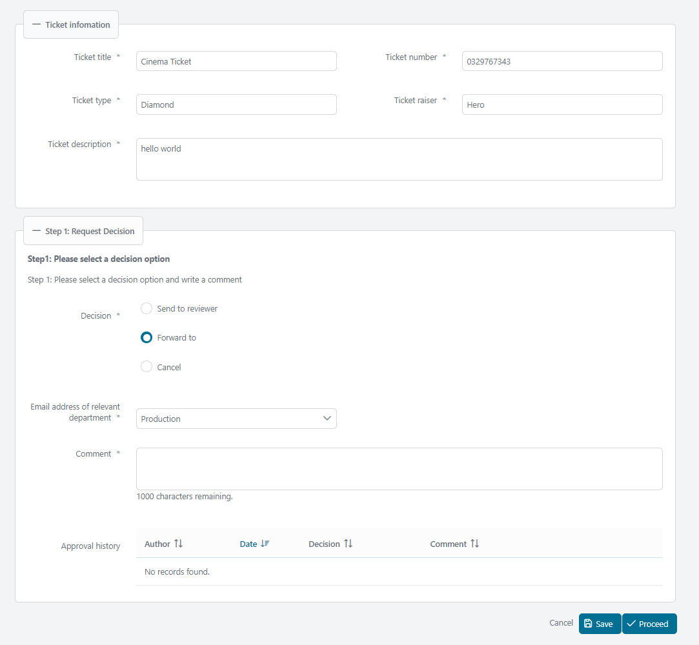

# Approval Decision Utils

Axon Ivy's Approval Decision Utils provides a standardized approach for implementing your approvals in any business process. This component:

- Gives you a standard pattern to make decisions and confirmations.
- Implements a comment function for better documentation.
- Provides a clear view of the ongoing approval history to meet regulatory, compliance, and transparency requirements.
- Supports you with an easy-to-copy demo implementation to reduce your integration effort.

## Demo

### 1. Display decision option

### 2. Validate decision option

### 3. Track approval history

### 4. Select confirmation checkbox

## Setup

### Approach

Decision data is stored in a database table named `ApprovalHistory`. This table stores the selected decisions, comments, approval dates, and confirmations.

The data from this table will be utilized to populate the Approval History section.

### Set up database

- Create the `ApprovalHistory` table with default columns for storing decision data. Additional columns can be added based on business. You can also modify the table name.
- The `RequestApprovalHistory` table establishes the relationship between your business data and the approval history.

For example, suppose your business data is stored in a table named `TicketRequest`. The following script creates tables and establishes the relationship.

    create table ApprovalHistory (
    	id varchar(32) not null,
    	...
    );

    create table RequestApprovalHistory (
    	requestId varchar(32) not null,
    	approvalHistoryId varchar(32) not null,
    	primary key (requestId, approvalHistoryId)
    )

    alter table RequestApprovalHistory
       add constraint fk_requestApprovalHistory_request
       foreign key (requestId)
       references TicketRequest(id)

    alter table RequestApprovalHistory
       add constraint fk_requestApprovalHistory_approvalHistory
       foreign key (approvalHistoryId)
       references ApprovalHistory(id);

### Implement the Java backend

The component uses [Axon Ivy Persistence Utils](https://github.com/axonivy-market/persistence-utils) library to interact with the database.

- Your business entity needs to extend the `BaseRequest` class.
- The `ApprovalHistory` entity needs to extend the `BaseApprovalHistory` class.

Example:

    public class TicketRequest extends BaseRequest<ApprovalHistory>{}
    public class ApprovalHistory extends BaseApprovalHistory{}

### Integrate Approval decision to HTML dialog

Example:

     <ic:com.axonivy.utils.approvaldecision.ApprovalDecision
    	id="approvalDecision"
    	managedBean="#{managedBean.approvalDecisionBean}"
    	validatorId="#{managedBean.approvalDecisionBean.validatorId}"
    	fieldsetLegend="Request Decision"
    	fieldsetToggleable="#{true}"
    	fieldsetStyleClass="p-mt-3"
    	headline="Step 1: Pelease select a decision option"
    	headlinePanelStyleClass=""
    	headlineStyleClass="p-text-bold"
    	helpText="My help text"
    	helpTextPanelStyleClass=""
    	helpTextStyleClass=""
    	decisionRendered="#{managedBean.contentState.decisionRendered}"
    	decisionDisable="#{managedBean.contentState.decisionDisable}"
    	decisionRequired="#{managedBean.contentState.decisionRequired}"
    	listenerOnDecisionAction="#{managedBean.onChangeDecision()}"
    	componentToUpdateOnDecision="approvalDecision:dropDownListOfMails"
    	commentRendered="#{managedBean.contentState.commentRendered}"
    	commentRequired="#{managedBean.contentState.commentRequired}"
    	approvalHistoryRendered="#{managedBean.contentState.approvalHistoryRendered}">

### Create managed bean

Create the managed bean of this component by extending `com.axonivy.utils.approvaldecision.managedbean.AbstractApprovalDecisionBean` class.

By default, the component uses the enum `com.axonivy.utils.approvaldecision.enums.ApprovalDecisionOption` to obtain decision options. If you prefer to use your own enum as options for decision, override the methods `getDecisionLabel()`, `getDecisions()`.

### Handle save/submit approval histories in your managed bean.

Handle save/submit by calling methods from the managed bean created from previous step:

- `handleApprovalHistoryBeforeSave()`: triggered when the `Save` action is called.
- `handleApprovalHistoryBeforeSubmit()`: triggered when the `Submit` action is called.

Proceed to map approval histories to the entity and save.

Example: in the managed bean `TicketProcessBean`:

    public void save() {
    	approvalDecisionBean.handleApprovalHistoryBeforeSave(this.request.getApprovalHistories());
    	handleSaving();
    	TicketProcessUtils.showInfo();
    }
    private void handleSaving() {
    	TicketRequest saved = TicketRequestDAO.getInstance().save(this.request);
    	setRequest(saved);
    	this.approvalDecisionBean.setApprovalHistory(this.request.getApprovalHistories().stream()
    			.filter(p -> p.getIsEditing()).findFirst().orElse(new ApprovalHistory()));
    }

### Customize Approval history table (Optional)

The Approval history table is initially sorted by approval date in descending order. To customize the sort order, start by disabling the default sort through overriding the method `isApprovalHistoryTableSortDescending()`.

    @Override public boolean isApprovalHistoryTableSortDescending() { return false; }

Next, implement the custom sort by overriding the method `getApprovalHistoryTableSortField()`. The following fields are supported to sort:

- displayApprovalDate: Approval date.
- displayUserName: Name of the creator.
- comment: Comment.

Example:

    @Override public String getApprovalHistoryTableSortField() { return "displayUserName"; }

### Attributes

- `managedBean`: It is required and must extend `com.axonivy.utils.approvaldecision.managedbean.AbstractApprovalDecisionBean` class.
- `isReadOnly`: Configures the component to be read-only. The default is `false`.
- `fieldsetToggleable`: Makes the fieldset toggleable. Default is `false`.
- `fieldsetLegend`: Legend text of the fieldset. Default is `Approval decision`.
- `fieldsetStyleClass`: Style class of the fieldset.
- `headline`: Headline text inside the component.
- `headlinePanelStyleClass`: Style class for the panel of the headline.
- `helpText`: Help text inside the component.
- `helpTextPanelStyleClass`: Style class for the panel of the help text.
- `helpTextStyleClass`: Style class for the help text.
- `validatorId`: ID of the validator, default value is `approvalDecisionValidator` (`com.axonivy.utils.approvaldecision.validation.ApprovalDecisionValidator`).
- `decisionLabel`: Label for the decision options.
- `decisionRequired`: Flag to perform a mandatory check for decision. Default is `true`.
- `decisionRendered`: Flag to render decision options. Default is `true`.
- `decisionRequiredMessage`: Error message displayed when performing a mandatory check for the decision options. The default value is the CMS `/Labels/RequiredFieldMessage`.
- `decisionPanelStyleClass`: Style class for the panel of decision options.
- `listenerOnDecisionAction`: Listener event to be triggered when a decision is selected.
- `componentToUpdateOnDecision`: Components to be updated when a decision is selected. The default value is `@this`.
- `decisionCommentLabel`: Label for the comment. Default value is the CMS `/Labels/Comment`.
- `commentRequired`: Flag to perform mandatory check for comment. Default is `true`.
- `commentRendered`: Flag to render comment. Default is `true`.
- `commentRequiredMessage`: Error message displayed when performing mandatory check for comment. Default value is the CMS `/Labels/RequiredFieldMessage`.
- `commentPanelStyleClass`: Style class for the comment panel.
- `confirmationRequired`: Flag to perform mandatory check for the confirmation options. Default is `false`.
- `confirmationRequiredMessage`: Error message displayed when performing mandatory check for the confirmation options. Default value is the CMS `/Labels/RequiredFieldMessage`.
- `confirmationPanelStyleClass`: Style class for the panel of the confirmation options.
- `confirmationLabel`: Label for the confirmation options.
- `approvalHistoryRendered`: Flag to render the approval history table. Default is `true`.
- `approvalHistoryPanelStyleClass`: Style class for the panel of the approval history table.

Facets

---

- `customHeadline`: Custom headline. Use this when you need a more elaborate headline than simple text.

Example:

    <ic:com.axonivy.utils.approvaldecision.ApprovalDecision id="approvalDecision"
    managedBean="#{managedBean.approvalDecisionBean}">
    	<f:facet name="customHeadline">
    	  
Please check this <a href="www.google.com">Email</a> before proceed

    	</f:facet>
    </ic:com.axonivy.utils.approvaldecision.ApprovalDecision>

- `customHelpText`: Custom help text. Use this when you need a more elaborate help text than simple text.

Example:

    <ic:com.axonivy.utils.approvaldecision.ApprovalDecision id="approvalDecision"
    managedBean="#{managedBean.approvalDecisionBean}">
    	<f:facet name="customHelpText">
    	  
Please check this <a href="www.google.com">Email</a> before proceed

    	</f:facet>
    </ic:com.axonivy.utils.approvaldecision.ApprovalDecision>

- `customContent`: Custom content for special requirements.

Example: The following code adds the label `Email address of relevant department` and the dropdown list to the content.

    <ic:com.axonivy.utils.approvaldecision.ApprovalDecision id="approvalDecision"
    	managedBean="#{managedBean.approvalDecisionBean}">
    	<f:facet name="customContent">
    	  <h:panelGroup id="dropDownListOfMails">
    		  <h:panelGroup id="mail-panel"
    			layout="block"
    			styleClass="p-formgrid p-grid p-align-baseline ui-fluid"
    			rendered="#{managedBean.contentState.showDropdownOfMails}">
    			

    			  <p:outputLabel for="dropdownlist-mail"
    				value="Email address of relevant department">
    				*
    			  </p:outputLabel>
    			

    			

    			  <p:selectOneMenu id="dropdownlist-mail"
    				value="#{managedBean.request.forwardToMail}"
    				requiredMessage="#{ivy.cms.co('/Labels/RequiredFieldMessage')}">
    				<f:selectItem itemLabel="SelectOne" itemValue="" />
    				<f:selectItems
    				  value="#{managedBean.departmentMails.entrySet()}"
    				  var="department" itemLabel="#{department.key}"
    				  itemValue="#{department.value}" />
    				<f:validator validatorId="aprovalDecisionValidator" />
    			  </p:selectOneMenu>
    			  <p:message for="dropdownlist-mail" />
    			

    		  </h:panelGroup>
    		</h:panelGroup>
    	</f:facet>
    </ic:com.axonivy.utils.approvaldecision.ApprovalDecision>

