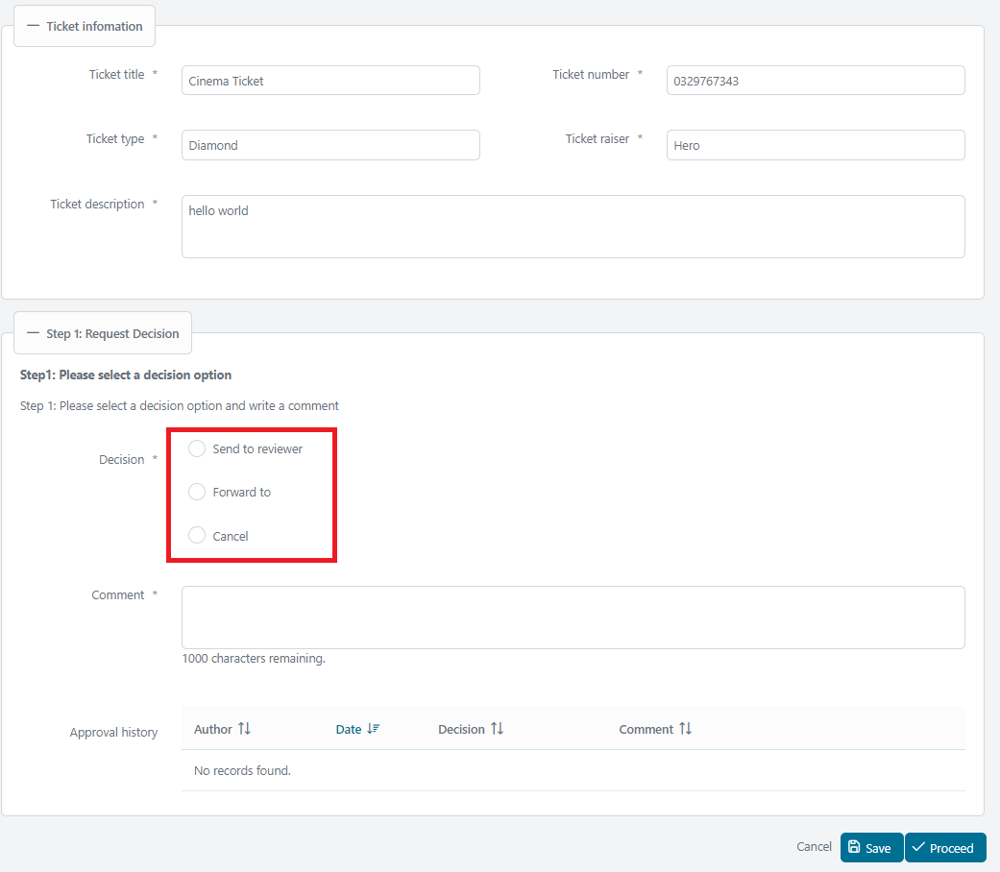
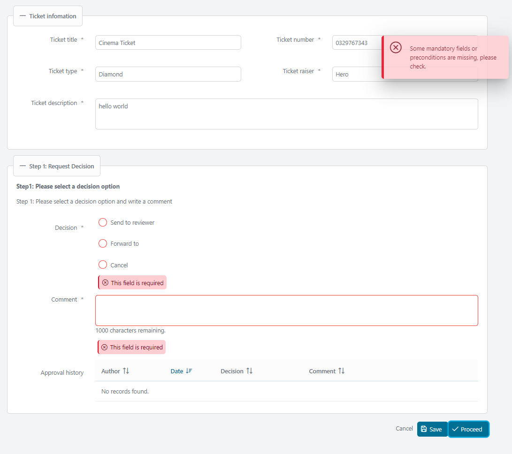
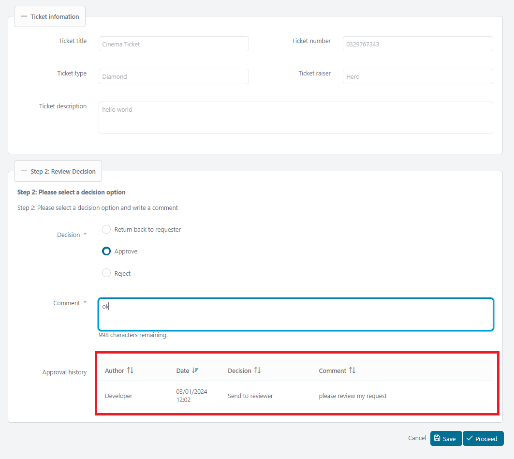
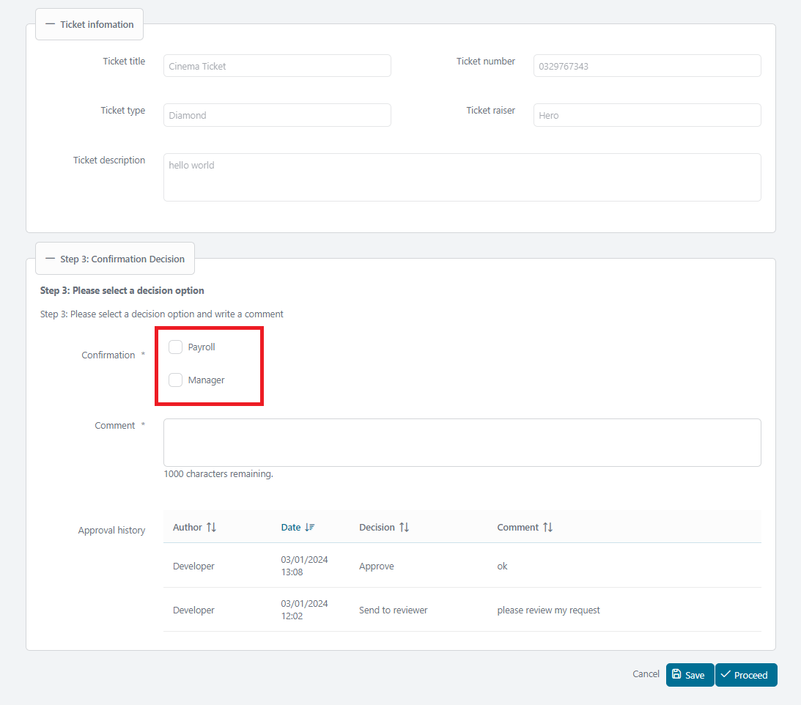
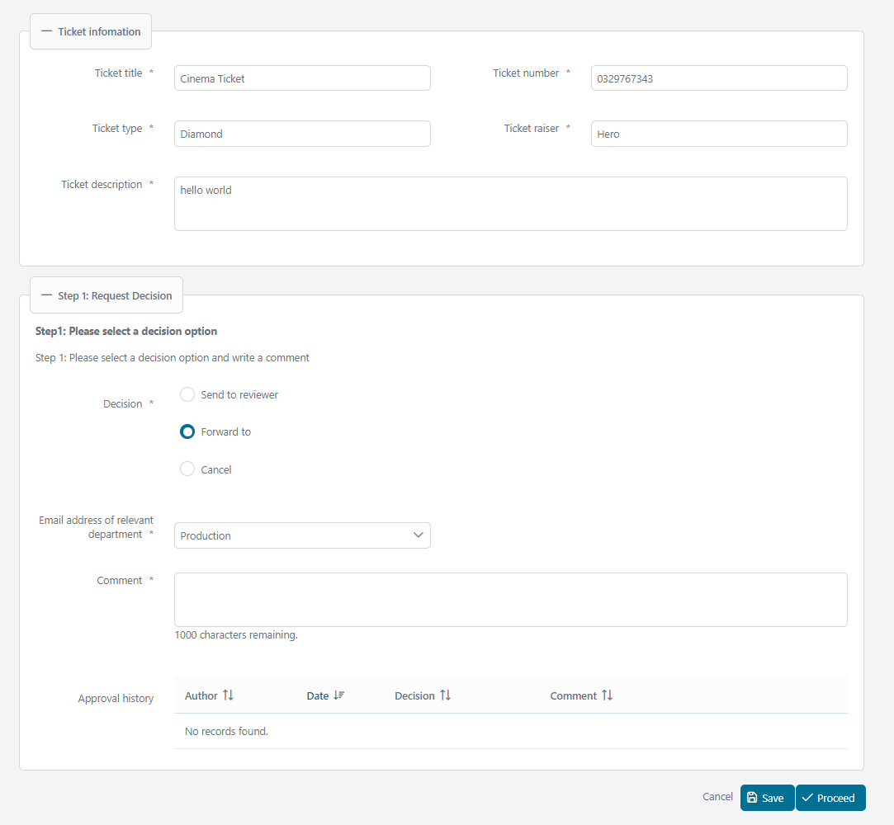

# Approval Decision Utils

Axon Ivy's Approval Decision Utils bietet einen standardisierten Ansatz zur Implementierung von Genehmigungen in jedem Geschäftsprozess. 

Diese Komponente:

- gibt Dir ein Template für Entscheidungs- und Bestätigungsprozesse.
- implementiert eine Kommentarfunktion für eine bessere Dokumentation.
- bietet eine klare Übersicht über die laufende Genehmigungshistorie, um regulatorische, Compliance- und Transparenzanforderungen zu erfüllen.

## Demo

### 1. Entscheidungsoption anzeigen

### 2. Entscheidungsoption validieren

### 3. Genehmigungshistorie nachverfolgen

### 4. Bestätigungs-Checkbox auswählen

## Setup

### Vorgehensweise

Entscheidungsdaten werden in einer Datenbanktabelle namens `ApprovalHistory` gespeichert. Diese Tabelle speichert die ausgewählten Entscheidungen, Kommentare, Genehmigungsdaten und Bestätigungen.

Die Daten aus dieser Tabelle werden verwendet, um den Bereich der Genehmigungshistorie zu füllen.

### Datenbank einrichten

- Erstelle die Tabelle `ApprovalHistory` mit Standardspalten zur Speicherung der Entscheidungsdaten. Zusätzliche Spalten können je nach Geschäftsanforderungen hinzugefügt werden. Du kannst auch den Tabellennamen ändern.
- Die Tabelle `RequestApprovalHistory` stellt die Beziehung zwischen Deinen Geschäftsdaten und der Genehmigungshistorie her.

Zum Beispiel, wenn Deine Geschäftsdaten in einer Tabelle namens `TicketRequest` gespeichert sind. Das folgende Skript erstellt Tabellen und stellt die Beziehung her.

    create table ApprovalHistory (
    	id varchar(32) not null,
    	...
    );

    create table RequestApprovalHistory (
    	requestId varchar(32) not null,
    	approvalHistoryId varchar(32) not null,
    	primary key (requestId, approvalHistoryId)
    )

    alter table RequestApprovalHistory
       add constraint fk_requestApprovalHistory_request
       foreign key (requestId)
       references TicketRequest(id)

    alter table RequestApprovalHistory
       add constraint fk_requestApprovalHistory_approvalHistory
       foreign key (approvalHistoryId)
       references ApprovalHistory(id);

### Implementiere das Java-Backend

Die Komponente verwendet die [Axon Ivy Persistence Utils](https://github.com/axonivy-market/persistence-utils) Bibliothek, um mit der Datenbank zu interagieren.

- Deine Geschäftsentität muss die Klasse `BaseRequest` erweitern.
- Die Entität `ApprovalHistory` muss die Klasse `BaseApprovalHistory` erweitern.

Beispiel:

    public class TicketRequest extends BaseRequest<ApprovalHistory>{}
    public class ApprovalHistory extends BaseApprovalHistory{}

### Integriere die Genehmigungsentscheidung in den HTML-Dialog

Beispiel:

     <ic:com.axonivy.utils.approvaldecision.ApprovalDecision
    	id="approvalDecision"
    	managedBean="#{managedBean.approvalDecisionBean}"
    	validatorId="#{managedBean.approvalDecisionBean.validatorId}"
    	fieldsetLegend="Request Decision"
    	fieldsetToggleable="#{true}"
    	fieldsetStyleClass="p-mt-3"
    	headline="Schritt 1: Bitte wähle eine Entscheidungsoption"
    	headlinePanelStyleClass=""
    	headlineStyleClass="p-text-bold"
    	helpText="Mein Hilfetext"
    	helpTextPanelStyleClass=""
    	helpTextStyleClass=""
    	decisionRendered="#{managedBean.contentState.decisionRendered}"
    	decisionDisable="#{managedBean.contentState.decisionDisable}"
    	decisionRequired="#{managedBean.contentState.decisionRequired}"
    	listenerOnDecisionAction="#{managedBean.onChangeDecision()}"
    	componentToUpdateOnDecision="approvalDecision:dropDownListOfMails"
    	commentRendered="#{managedBean.contentState.commentRendered}"
    	commentRequired="#{managedBean.contentState.commentRequired}"
    	approvalHistoryRendered="#{managedBean.contentState.approvalHistoryRendered}">

### Managed Bean erstellen

Erstelle die Managed Bean dieser Komponente, indem Du die Klasse `com.axonivy.utils.approvaldecision.managedbean.AbstractApprovalDecisionBean` erweiterst.

Standardmäßig verwendet die Komponente das Enum `com.axonivy.utils.approvaldecision.enums.ApprovalDecisionOption`, um Entscheidungsoptionen zu erhalten. Falls Du Dein eigenes Enum für die Optionen verwenden möchtest, überschreibe die Methoden `getDecisionLabel()` und `getDecisions()`.

### Genehmigungshistorien in Deiner Managed Bean speichern/übermitteln

Behandle das Speichern/Übermitteln, indem Du die Methoden der Managed Bean aufrufst, die im vorherigen Schritt erstellt wurde:

- `handleApprovalHistoryBeforeSave()`: Wird ausgelöst, wenn die Aktion `Speichern` aufgerufen wird.
- `handleApprovalHistoryBeforeSubmit()`: Wird ausgelöst, wenn die Aktion `Übermitteln` aufgerufen wird.

Fahre fort, die Genehmigungshistorien der Entität zuzuordnen und zu speichern.

Beispiel: In der Managed Bean `TicketProcessBean`:

    public void save() {
    	approvalDecisionBean.handleApprovalHistoryBeforeSave(this.request.getApprovalHistories());
    	handleSaving();
    	TicketProcessUtils.showInfo();
    }
    private void handleSaving() {
    	TicketRequest saved = TicketRequestDAO.getInstance().save(this.request);
    	setRequest(saved);
    	this.approvalDecisionBean.setApprovalHistory(this.request.getApprovalHistories().stream()
    			.filter(p -> p.getIsEditing()).findFirst().orElse(new ApprovalHistory()));
    }

### Genehmigungshistorientabelle anpassen (Optional)

Die Genehmigungshistorientabelle wird standardmäßig nach dem Genehmigungsdatum in absteigender Reihenfolge sortiert. Um die Sortierreihenfolge anzupassen, deaktiviere zuerst die Standardsortierung, indem Du die Methode `isApprovalHistoryTableSortDescending()` überschreibst.

    @Override public boolean isApprovalHistoryTableSortDescending() { return false; }

Implementiere anschließend die benutzerdefinierte Sortierung, indem Du die Methode `getApprovalHistoryTableSortField()` überschreibst. Die folgenden Felder werden zur Sortierung unterstützt:

- displayApprovalDate: Genehmigungsdatum.
- displayUserName: Name des Erstellers.
- comment: Kommentar.

Beispiel:

    @Override public String getApprovalHistoryTableSortField() { return "displayUserName"; }

### Attribute

- `managedBean`: Ist erforderlich und muss die Klasse `com.axonivy.utils.approvaldecision.managedbean.AbstractApprovalDecisionBean` erweitern.
- `isReadOnly`: Konfiguriert die Komponente als schreibgeschützt. Standardmäßig ist der Wert `false`.
- `fieldsetToggleable`: Macht das Fieldset umschaltbar. Standardmäßig ist der Wert `false`.
- `fieldsetLegend`: Legendentext des Fieldsets. Standardmäßig ist der Wert `Approval decision`.
- `fieldsetStyleClass`: Stilklasse des Fieldsets.
- `headline`: Überschriftstext innerhalb der Komponente.
- `headlinePanelStyleClass`: Stilklasse für das Panel der Überschrift.
- `helpText`: Hilfetext innerhalb der Komponente.
- `helpTextPanelStyleClass`: Stilklasse für das Panel des Hilfetextes.
- `helpTextStyleClass`: Stilklasse für den Hilfetext.
- `validatorId`: ID des Validators, Standardwert ist `approvalDecisionValidator` (`com.axonivy.utils.approvaldecision.validation.ApprovalDecisionValidator`).
- `decisionLabel`: Beschriftung für die Entscheidungsoptionen.
- `decisionRequired`: Flag für eine obligatorische Prüfung der Entscheidung. Standardwert ist `true`.
- `decisionRendered`: Flag zum Anzeigen der Entscheidungsoptionen. Standardwert ist `true`.
- `decisionRequiredMessage`: Fehlermeldung, die bei einer obligatorischen Prüfung der Entscheidungsoptionen angezeigt wird. Der Standardwert ist das CMS `/Labels/RequiredFieldMessage`.
- `decisionPanelStyleClass`: Stilklasse für das Panel der Entscheidungsoptionen.
- `listenerOnDecisionAction`: Listener-Ereignis, das ausgelöst wird, wenn eine Entscheidung ausgewählt wird.
- `componentToUpdateOnDecision`: Komponenten, die aktualisiert werden sollen, wenn eine Entscheidung ausgewählt wird. Standardwert ist `@this`.
- `decisionCommentLabel`: Beschriftung für den Kommentar. Standardwert ist das CMS `/Labels/Comment`.
- `commentRequired`: Flag für eine obligatorische Prüfung des Kommentars. Standardwert ist `true`.
- `commentRendered`: Flag zum Anzeigen des Kommentars. Standardwert ist `true`.
- `commentRequiredMessage`: Fehlermeldung, die bei einer obligatorischen Prüfung des Kommentars angezeigt wird. Der Standardwert ist das CMS `/Labels/RequiredFieldMessage`.
- `commentPanelStyleClass`: Stilklasse für das Kommentarpanel.
- `confirmationRequired`: Flag für eine obligatorische Prüfung der Bestätigungsoptionen. Standardwert ist `false`.
- `confirmationRequiredMessage`: Fehlermeldung, die bei einer obligatorischen Prüfung der Bestätigungsoptionen angezeigt wird. Der Standardwert ist das CMS `/Labels/RequiredFieldMessage`.
- `confirmationPanelStyleClass`: Stilklasse für das Panel der Bestätigungsoptionen.
- `confirmationLabel`: Beschriftung für die Bestätigungsoptionen.
- `approvalHistoryRendered`: Flag zum Anzeigen der Genehmigungshistorientabelle. Standardwert ist `true`.
- `approvalHistoryPanelStyleClass`: Stilklasse für das Panel der Genehmigungshistorientabelle.

Facets

---

- `customHeadline`: Benutzerdefinierte Überschrift. Verwende dies, wenn Du eine aufwendigere Überschrift als einfachen Text benötigst.

Beispiel:

    <ic:com.axonivy.utils.approvaldecision.ApprovalDecision id="approvalDecision"
    managedBean="#{managedBean.approvalDecisionBean}">
    	<f:facet name="customHeadline">
    	  
Bitte überprüfe diese <a href="www.google.com">E-Mail</a>, bevor Du fortfährst

    	</f:facet>
    </ic:com.axonivy.utils.approvaldecision.ApprovalDecision>

- `customHelpText`: Benutzerdefinierter Hilfetext. Verwende dies, wenn Du einen aufwendigeren Hilfetext als einfachen Text benötigst.

Beispiel:

    <ic:com.axonivy.utils.approvaldecision.ApprovalDecision id="approvalDecision"
    managedBean="#{managedBean.approvalDecisionBean}">
    	<f:facet name="customHelpText">
    	  
Bitte überprüfe diese <a href="www.google.com">E-Mail</a>, bevor Du fortfährst

    	</f:facet>
    </ic:com.axonivy.utils.approvaldecision.ApprovalDecision>

- `customContent`: Benutzerdefinierter Inhalt für spezielle Anforderungen.

Beispiel: Der folgende Code fügt das Label `E-Mail-Adresse der relevanten Abteilung` und die Dropdown-Liste zum Inhalt hinzu.

    <ic:com.axonivy.utils.approvaldecision.ApprovalDecision id="approvalDecision"
    	managedBean="#{managedBean.approvalDecisionBean}">
    	<f:facet name="customContent">
    	  <h:panelGroup id="dropDownListOfMails">
    		  <h:panelGroup id="mail-panel"
    			layout="block"
    			styleClass="p-formgrid p-grid p-align-baseline ui-fluid"
    			rendered="#{managedBean.contentState.showDropdownOfMails}">
    			

    			  <p:outputLabel for="dropdownlist-mail"
    				value="E-Mail-Adresse der relevanten Abteilung">
    				*
    			  </p:outputLabel>
    			

    			

    			  <p:selectOneMenu id="dropdownlist-mail"
    				value="#{managedBean.request.forwardToMail}"
    				requiredMessage="#{ivy.cms.co('/Labels/RequiredFieldMessage')}">
    				<f:selectItem itemLabel="SelectOne" itemValue="" />
    				<f:selectItems
    				  value="#{managedBean.departmentMails.entrySet()}"
    				  var="department" itemLabel="#{department.key}"
    				  itemValue="#{department.value}" />
    				<f:validator validatorId="aprovalDecisionValidator" />
    			  </p:selectOneMenu>
    			  <p:message for="dropdownlist-mail" />
    			

    		  </h:panelGroup>
    		</h:panelGroup>
    	</f:facet>
    </ic:com.axonivy.utils.approvaldecision.ApprovalDecision>

